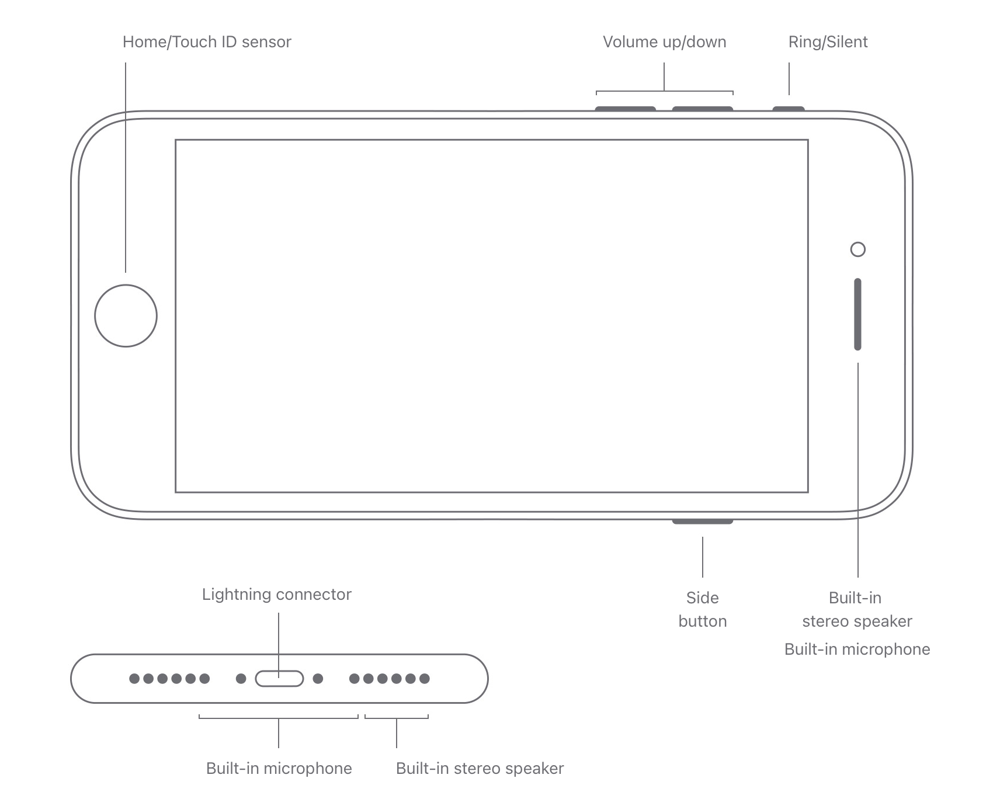
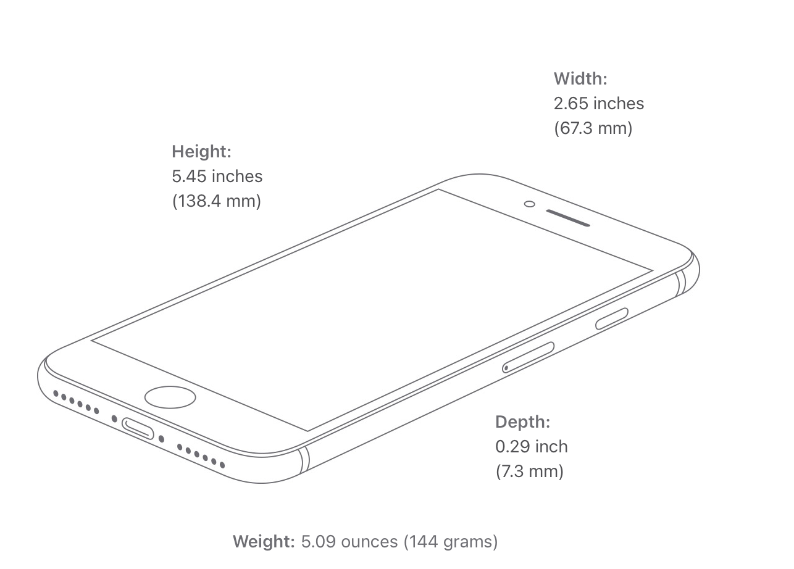
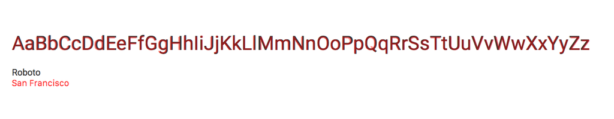

# Quantori Homework #1

### Introducing to HTMl, CSS, Git

---

**Main branch:** <a href="https://mordvintsevmv.github.io/quantori_homework_1" target="_blank">Open page</a>

**Description:** *The main branch of the app.*

---

**Feature | Static Iphone Branch:** <a href="https://quantori-hw1-feature-static.netlify.app/" target="_blank">Open page</a>

**Description:** *All elements of the iPhone SE 2020 are implemented using pure HTML and CSS (SCSS).*

---

**Feature | JavaScript Iphone Branch:** <a href="https://quantori-hw1-feature-js.netlify.app/" target="_blank">Open page</a>

**Description:** *Added JS scripts:*

- *Button click events (mute, volume, power, home);*
- *Dynamic change of date and time.*

---

## <a name="content">Content</a>

0. [Task](#Task)
0. [Design](#design)
    1. [iPhone layout](#design-iphone)
    1. [Fonts](#design-fonts)
2. [Contacts](#contacts)

---

## <a name="Task">Task</a>

Implement the image below with HTML and CSS. (iPhone)
- [X] Set the background. It should be stretched to 100% of the height and width of the browser tab.

**Smartphone:**
- [X] Must be centered in relation to the page
- [X] Create a "screen" with an indentation. Fill it in a monochrome dark color, and the body in a color closer to the original.
- [X] Add rounded corners
- [X] Add a border of a different color to the phone
- [X] Add a "center round button" with a border
- [X] Add speaker/video camera elements (those above the screen)
- [X] Add side buttons 
- [X] A little more complicated variant - to set an image on the screen
- [X] Extra task  * - to create an image on the screen (clock, date, background, camera icon, Slide to unlock element, etc.)

---

## <a name="design">Design</a>

### <a name="design-iphone">iPhone layout</a>

iPhone se 2020 was taken as a basis.
All the dimensions and layout of the main elements were taken from the official [Apple website](https://www.apple.com/iphone-se/specs/).

*- iPhone layout*

*- iPhone sizes*

**Based on the found layouts , it was decided to take the following sizes as a basis:**

**iPhone height:** 138px;

**iPhone width:** 67px.

**According to screen resolution (16x9):**

**Screen height:** 16px;

**Screen height:** 9px.

The base sizes will change (x5, for example) during development to match the actual size of the iPhone.

### <a name="design-fonts">Fonts</a>

The terms of using Apple fonts (including iOS font SF Pro) include the following rule:

> 2. Permitted License Uses and Restrictions.
> 
> [...]
> 
> Subject to the terms of this License, you may use the Apple Font solely for creating mock-ups of user interfaces to be used in software products running on Apple’s iOS or OS X operating systems, as applicable. The foregoing right includes the right to show the Apple Font in screen shots, images, mock-ups or other depictions, digital and/or print, of such software products running solely on iOS or OS X.
> 
> [...]

*- Apple EULA*

To avoid license issues, it was decided to use a free Roboto font similar to SF Pro. 
The comparison is shown in the image:

*- Comparison of SF Pro and Roboto fonts*

[🔝Content🔝](#content)

---

## <a name="contacts">Contacts</a>

**TG**: [@mordvintsevmv](https://t.me/mordvintsevmv)

**e-mail**: mordvintsevmv@gmail.com

[🔝Content🔝](#content)
